## Project Description

* * *

The BBImageHandler for DotNetNuke and ASP.NET gives users and module programmers the opportunity to use a handler that displays resized images, adds watermarks to images, creates  thumbnails of web pages or displays images stored in a database table without storing them to harddisk. Additionally it could be used to create a counter display.

The project is based on the _Microsoft.Web.GeneratedImage_ Project here on [Codeplex](http://aspnet.codeplex.com/releases/view/16449). I added a few things to that base implementation of an image handler. Rendering of gif images is improved with OctreeQuantizer, some special handlers are added and security functionality was added. Some parameters are now configurable through web.config. Barcode generation (Version 1.3) is done by open source library [ZXing.NET](https://zxingnet.codeplex.com)

Even this project is declared as DNN project, it is usable by every ASP.NET application. But I added a DNN installation manifest to the downloadable install file so it could be installed in DNN with the normal installation process.

## Whats new ?

_Version 2.0.0 08.07.2016_  
- New version especially for DNN8+. With DNN8 comes the dnnImagehandler which is basically bbimagehandler without the special extensions like barcode etc. The version 2.0.0 of bbimagehandler brings back this funtionality. Sourcecode and documentation is availiable on Github: [https://github.com/weggetor/BBImageHandler-8](https://github.com/weggetor/BBImageHandler-8)

_Version 1.6.0 04.08.2014_  
- Added 2 configuration properties: ServerCacheExpiration (value in seconds,Default: 600 seconds) + ClientCacheExpiration (value in seconds, Default: 300 seconds)  
- Fixed Client Caching (now sending 304 when cache time is not expired)  
- Fixed bug when attaching watermark to indexed image format  

_Version 01.05.01 (25.03.2014):_  
- Fixed a bug that prevented showing an Image stored in the database.  
- Added display of weekend days in booking schedule display

_Version 01.05.00 (24.02.2014):_  
- Added generation of a “booking schedule”,  showing free, reserved + occupied state of an object for every day of 1 year

_Version 01.04.00 (28.01.2014):_  
- Added **defaultImage** parameter for an image to be displayed if error or image not available  
- Changed DNN Profile picture parameter from "db=ConnectionName" to "dnn=1" (e.g   
- Added some tolerance when parsing the **file** or **path** parameter (relative path starts at [Request.PhysicalApplicationPath](http://msdn.microsoft.com/de-de/library/system.web.httprequest.physicalapplicationpath%28v=vs.110%29.aspx))  
- Added **ImageUrl** parameter for display of an image from another website  
- As alternative to **File** parameter you can use p**ath** + i**ndex** (2nd image in folder xyz, alphabetical order)

_Version 01.03.00 (20.01.2014):_
- Added generation of barcodes : upca, ean8, ean13, code39, code128, itf, codabar, plessey, msi, qrcode, pdf417, aztec, datamatrix

_Version 01.02.00 (25.09.2013):_
- Added possibility to show dnn profile picture by userid and portalid  
- Added parameters **maxwidth** and **maxheight** to delimit image size to maximum values  
- fixed a bug when using gif images on 64 bit machines

_Version 01.01.00 (01.09.2013):_  
- Added security for db-type image generation  
- Added gamma,contrast,brightness,inverting + flipping images  
- Added percentage indicator generation  
- Added placeholder image generation  
- Improved webpage thumbnail generation

_Version 01.00.01 (23.06.2011):_  
- Initial release

## Installation

* * *
**for DNN**: Use the normal installation of DNN  
**for all other ASP.NET Websites**: Unzip install file, copy DLL to bin-folder, copy bbimagehandler.ashx file to web root and add the following to your web.config’s appSettings section:

```xml
<add key="BBImageHandler" value="EnableClientCache=true;EnableServerCache=true;EnableSecurity=true;EnableSecurityExceptions=true;ImageCompression=90&AllowedDomains=bitboxx.com" />
```

#### Parameters:

*   **EnableClientCache**: Set to true if client caching should be enabled
*   **EnableServerCache**: Set to true if server caching should be enabled
*   **EnableSecurity**: If set to true, only using bbimagehandler in a web page is allowed. Direct usage (eg: entering address in browser, no referer) is prohibited.  Also using it in a different domain is not possible (web page from http://www.domain-a.com uses [http://www.domain-b.com/bbimagehandler.ashx](http://www.domain-b.com/bbimagehandler.ashx)...)
*   **EnableSecurityExceptions**: Set to true if security exceptions should be thrown
*   **ImageCompression**: quality of resulting image (0..100)
*   **AllowedDomains**: Comma separated list of Domains that should be permitted to use the imagehandler. Use "domain.com" to permit including all subdomains an "www.domain.com" to allow only referers from this special subdomain

## Usage

* * *

### Resizing Image:

Resized Image including width-Tag:
```html

```

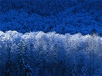

Resized Image including height-Tag:  
```

```


Resized Image with Border, BackColor and ResizeMode:  
```html
 
```
 (Escape '#' with '%23' in Url!)  

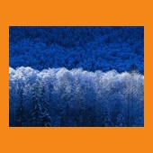

#### Parameters:

*   **file**: physical path including image name (relative path starts at [Request.PhysicalApplicationPath](http://msdn.microsoft.com/de-de/library/system.web.httprequest.physicalapplicationpath%28v=vs.110%29.aspx))
*   or **path**: path (absolute or relative path to image directory) and **index**: index of file in directory (alphabetical order)

*   **width**: width in pixel of resulting image
*   **height**: height in pixel of resulting image
*   **maxwidth** and **maxheight**: instead of width and / or height you can use maxwidth and/or maxheight to leave the picture as it is until the width or height reaches the max value.
*   **resizemode**:
    *   **fit**: Fit mode maintains the aspect ratio of the original image while ensuring that the dimensions of the result do not exceed the maximum values for the resize transformation. (Needs _width_ or _height_ parameter)
    *   **fitsquare**: Resizes the image with the given width as its longest side (depending on image direction) and maintains the aspect ratio. The image will be centered in a square area of the chosen background color (Needs _width_ parameter, _backcolor_ optional)
    *   **crop**: Crop resizes the image and removes parts of it to ensure that the dimensions of the result are exactly as specified by the transformation.(Needs _width_ and _height_ parameter)
*   **backcolor**: color of background or/and  border when _resizemode_ is f_itsquare_ or f_it_.
*   **border**: border width in pixels around the image (added to width / height) when _resizemode_ is f_itsquare_ or f_it_.
*   **format**: jpg,png,bmp or gif, defines the format of the resulting image

* * *

## Gamma correction

```html

```

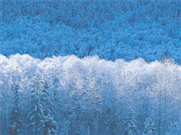

### Parameters:

*   **Gamma**: Value for gamma adjustment between 0.2 and 5

* * *

## Brightness correction

```html

```
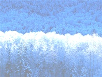

### Parameters:

*   **Brightness**: Value for brightness adjustment between -255 and +255

* * *

## Contrast correction

```html

```

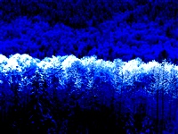

### Parameters:

*   **Contrast**: Value for contrast adjustment between -100 and +100

* * *

## Greyscale

```html

```

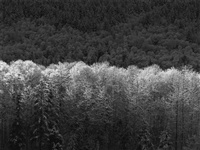

### Parameters:

*   **Greyscale**: Add any value

* * *

## Invert

```html

```

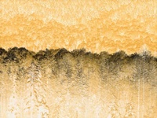

### Parameters:

*   **Invert**: Add any value

* * *

## Rotate / Flip

```html

```

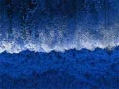

### Parameters:

*   **RotateNoneFlipNone**: Specifies no clockwise rotation and no flipping.
*   **Rotate90FlipNone**: Specifies a 90-degree clockwise rotation without flipping.
*   **Rotate180FlipNone**: Specifies a 180-degree clockwise rotation without flipping.
*   **Rotate270FlipNone**: Specifies a 270-degree clockwise rotation without flipping.
*   **RotateNoneFlipX**: Specifies no clockwise rotation followed by a horizontal flip.
*   **Rotate90FlipX**: Specifies a 90-degree clockwise rotation followed by a horizontal flip.
*   **Rotate180FlipX**: Specifies a 180-degree clockwise rotation followed by a horizontal flip.
*   **Rotate270FlipX**: Specifies a 270-degree clockwise rotation followed by a horizontal flip.
*   **RotateNoneFlipY**: Specifies no clockwise rotation followed by a vertical flip.
*   **Rotate90FlipY**: Specifies a 90-degree clockwise rotation followed by a vertical flip.
*   **Rotate180FlipY**: Specifies a 180-degree clockwise rotation followed by a vertical flip.
*   **Rotate270FlipY**: Specifies a 270-degree clockwise rotation followed by a vertical flip.
*   **RotateNoneFlipXY**: Specifies no clockwise rotation followed by a horizontal and vertical flip.
*   **Rotate90FlipXY**: Specifies a 90-degree clockwise rotation followed by a horizontal and vertical flip.
*   **Rotate180FlipXY**: Specifies a 180-degree clockwise rotation followed by a horizontal and vertical flip.
*   **Rotate270FlipXY**: Specifies a 270-degree clockwise rotation followed by a horizontal and vertical flip.

* * *

### Using watermarks:

```html

```

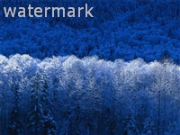

#### Parameters:

*   **watermarkposition**: TopLeft, TopCenter, TopRight, CenterLeft, Center, CenterRight, BottomLeft, BottomCenter, BottomRight
*   **watermarktext**: The text to display as watermark
*   **watermarkfontfamily**: the font name used for watermarktext. (Default:Verdana)
*   **watermarkfontcolor**: color name or html-color with leading '#' (eg. 'red', '#F0F0F0') (Default:Black)
*   **watermarkfontsize**: font size (Default: 14)
*   **watermarkopacity**: grade of opacity (0..255) (0 is transparent)

* * *

### Images stored in Database

If your image is stored in a database field (SqlDbType:Image), you can use the following syntax:
```html

```

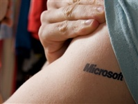

#### Parameters:

*   **db**: key of connectionstring section in web.config (for DNN normally 'SiteSqlServer')
*   **table**: Name of the table in database
*   **imagefield**: name of the image-field containing the image data
*   **idfield**: name of the field containing the primary key (must be integer-id!)
*   **idvalue**: value of id

**Exposing connection strings (even just by name), database names, table names, ID field names, and ID field values may be a security concern in internet scenarios. It doesn't open up a direct attack vector but exposes more to the public than necessary.**

Alternatively you can add the needed infos in your web.config in the appsettings section:

```html
<add key ="BBDatabase" value ="Connectionstring=SiteSqlServer;table=MyImages;ImageField=ImageData;idField=ImageID" />
```

with this defined in web.config your link has much less information for attackers:

```html
 
```

### Parameters:

*   **db**: key of appsetting entry in web.config (e.g. "BBDatabase")
*   **idvalue**: value of id

* * *

### DNN Profile picture:

Profile picture of a DNN User:  

```html

```


### Parameters:

*   **dnn**: Any value (e.g. dnn=1) [Changed in V 1.4.0]
*   **userid**: userid of the user whose profile picture should be shown
*   **portalid**: the portalid in which the user resides

**Don't forget that you can combine the most parameters (not only for the profile pic option). So it is possible to pimp your profile pic as inverted with border and watermark**

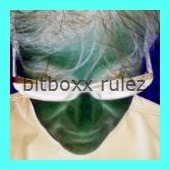

* * *

## Web Image

Image from another website  
```html

```


### Parameters:

*   **imageurl**: Url of the image to be displayed

* * *

### Webpage Thumbnail:

Url Thumbnail of Webpage:
```html
 
```


#### Parameters:

*   **url**: Url of the Web page from which the thumbnail should be done
*   **ratio**:
    *   **full**: Make a thumb of the full web page (Default)
    *   **screen**: Make a thumb with dimensions 3:2 (cut of rest)
    *   **cinema**: Make a thumb with dimensions 16:9 (cut of rest)

* * *

### Counter:

Using as counter:
```html

```

[](image_23.png)

#### Parameters:

*   **File**: Must be special counter image file with digits 0 to 9 with similar width per digit: [](image_25.png)
*   **digits**: No of digits.
*   **counter**: Value to display

* * *

## Percentage

Using as radial percentage indicator:
```html

```
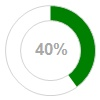

### Parameters:

*   **percentage**: Percentage value
*   **backcolor**: Color of percentage indicator

* * *

## Placeholder

Generates a placeholder image:
```html

```

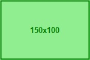

### Parameters:

*   **Placeholder**: Any value (e.g. Placeholder=1)
*   **Width**: Width of resulting image (this or Height must be defined)
*   **Height**: Height of resulting image (this or Width must be defined)
*   **Color**: Color of text and border (Default: dark grey, optional)
*   **BackColor**: Backcolor of Image (Default:light grey, optional)
*   **Text**: Text to show on image. If not used, image dimensions will be shown

* * *

## Barcode

Generates a barcode image:
```html

```


### Parameters:

*   **barcode**: Any value (e.g. barcode=1)
*   **type**: upca, ean8, ean13, code39, code128, itf, codabar, plessey, msi, qrcode, pdf417, aztec, datamatrix
*   **Width**: Width of resulting barcode
*   **Height**: Height of resulting barcode
*   **Border**: Width of border (Specifies margin, in pixels, to use when generating the barcode. The meaning can vary by format; for example it controls margin before and after the barcode horizontally for most 1D formats.)
*   **Content**: The content of the barcode (numeric or alphanumeric,depends on barcode type)

(Barcode generation is made by open source library [ZXing.NET](https://zxingnet.codeplex.com))

* * *

## Booking Schedule

Generates a 1 year booking schedule image:
```html

```

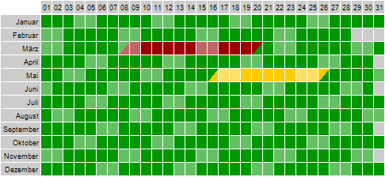

### Parameters:

*   **schedule**: Any value (e.g. schedule=year)
*   **backcolor**: color of background (optional, default = white)
*   **culture**: Culture abbrev (e.g. "en-us"). Needed for displaying month names (optional, default is CurrentCulture)
*   **Matrix**: String of length 12 * 31 = 372 (0 = no valid date (eg. Feb. 30), 1 = free, 2 = reserved, 3 = occupied, 4 = selected. Add +5 if weekend)